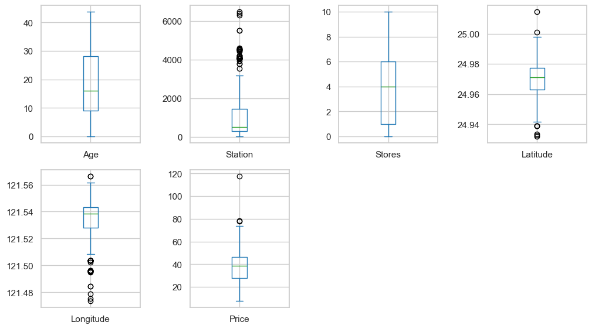
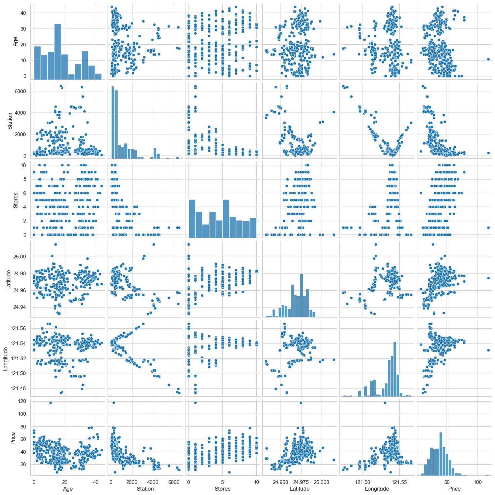
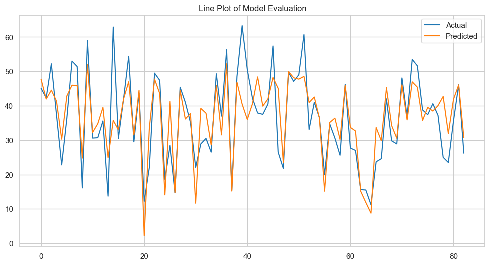

# MACHINE LEARNING WITH LINEAR REGRESSION ALGORITHM

* **Author:** Cheisa Billy Putra Antoni
* **Date:** 31 Jan 2026
* **Type:** Supervised Learning
* **Goals:** House Prices Prediction Model

---

## 1. Introduction

### 1.1. Machine Learning
Machine Learning is a branch of artificial intelligence that allows systems to learn from data. This project falls into the category of **Supervised Learning**, because it uses data with a known target variable.

### 1.2. Linear Regression
Linear Regression is a statistical and machine learning method used to model a linear relationship between one or more independent variables (X) and a dependent variable (Y), with the equation formulated as:

Y = b0 + b1(X1) + b2(X2) + ... + bn(Xn)

### 1.3. Regression Model Evaluation
The performance of the model is evaluated using several metrics, including:
- **Mean Squared Error (MSE)** to measure the average squared error
- **Root Mean Squared Error (RMSE)** to measure the square root of the average squared error
- **Mean Absolute Error (MAE)** to measure the average absolute error
- **R² Score** to measure the model’s ability to explain data variation

---

## 2. Data Description

### 2.1. Data Information
The dataset used is **`real_estate.csv`**. This dataset consists of 414 rows and 8 columns with several variables including:
- **No** is an index variable indicating the sequence number
- **X1 transaction date** is the transaction date variable
- **X2 house age** is the house age variable
- **X3 distance to the nearest MRT station** is the distance from the house to the nearest MRT station
- **X4 number of convenience stores** is the number of convenience stores around the house
- **X5 latitude** is the latitude variable
- **X6 longitude** is the longitude variable
- **Y house price of unit area** is the target variable to be predicted, namely house price per unit area

Dataset Source: [Kaggle](https://www.kaggle.com/datasets/quantbruce/real-estate-price-prediction)

### 2.2. Data Cleaning
At this stage, several columns that are not used in the analysis are removed, such as the **No** column and the **X1 transaction date** column. After that, column names are simplified. The renamed columns are as follows:
- **X2 house age** becomes **Age** (X1)
- **X3 distance to the nearest MRT station** becomes **Station** (X2)
- **X4 number of convenience stores** becomes **Stores** (X3)
- **X5 latitude** becomes **Latitude** (X4)
- **X6 longitude** becomes **Longitude** (X5)
- **Y house price of unit area** becomes **Price** (Y)

---

## 3. Exploratory Data Analysis

### 3.1. Descriptive Statistics
```text
              Age      Station      Stores    Latitude   Longitude       Price
count  414.000000   414.000000  414.000000  414.000000  414.000000  414.000000
mean    17.712560  1083.885689    4.094203   24.969030  121.533361   37.980193
std     11.392485  1262.109595    2.945562    0.012410    0.015347   13.606488
min      0.000000    23.382840    0.000000   24.932070  121.473530    7.600000
25%      9.025000   289.324800    1.000000   24.963000  121.528085   27.700000
50%     16.100000   492.231300    4.000000   24.971100  121.538630   38.450000
75%     28.150000  1454.279000    6.000000   24.977455  121.543305   46.600000
max     43.800000  6488.021000   10.000000   25.014590  121.566270  117.500000
``` 

### 3.2. Boxplot

The output above shows boxplot visualizations for each variable in the dataset. It can be observed that the **Station** and **Longitude** variables have significantly more outliers compared to the other variables.

### 3.3. Pairplot

The output above shows pairwise relationships between variables using scatter plots and histograms to display the distribution shape of each variable. Based on the results, the **Station** variable has a right-skewed distribution, while the **Longitude** variable has a left-skewed distribution.

### 3.4. Correlations
The correlation values of each pair of variables can be seen in the Notebook output, which displays correlation visualization in the form of a heatmap.

---

## 4. Data Preprocessing

### 4.1. Data Splitting
The dataset is divided into two parts, with 80% of the data used for training and the remaining 20% used for testing.

### 4.2. Data Scaling
At this stage, scaling is applied to the dataset using the Standardization method. This aims to equalize the range of values and prevent dominance by certain features.

---

## 5. Modelling
The model is built using a Machine Learning algorithm, namely **Linear Regression**. The model is trained using training data to learn the linear relationship between variable X (**Age**, **Station**, **Stores**, **Latitude**, **Longitude**) and variable Y (**Price**).

---

## 6. Model Evaluation

### 6.1. Evaluation Metrics
Evaluation is performed using testing data to measure the model’s performance on data it has never seen before. The evaluation metrics used and their results are as follows:
```text
MSE		    : 54.58094520086212
RMSE	    : 7.387891796775459
MAE		    : 5.350138374356212
R Square	: 0.6746481382828176
```

### 6.2. Line Plot of Model Evaluation

The output above shows a visualization comparing actual house prices with the house prices predicted by the model using testing data.

---

## 7. Exporting
The trained model is saved in **`.pkl`** format using the **`joblib`** library. This allows the model to be reused without retraining the data.

---

## 8. Conclusion
Based on the obtained results, it can be concluded that:
- The Linear Regression algorithm can be used to predict house prices with fairly good performance, achieving 67.46%.
- The resulting linear regression equation is Y = 38.39 - 3.06(X1) - 5.54(X2) + 3.26(X3) + 2.94(X4) - 0.36(X5)

---

## 9. Project Structure
```text
house-prices-prediction-model/
│
├── data/
│   └── real_estate.csv                     # House Price Dataset
│
├── images/
│   ├── boxplot.png                         # Boxplot Visualization
│   ├── lineplot.png                        # Lineplot Visualization
│   └── pairplot.png                        # Pairplot Visualization
|
├── models/
│   └── house_price_prediction_model.pkl    # Final Model
|
├── notebooks/
│   └── linear_regression.ipynb             # Main Code
│
├── .gitattributes
├── .gitignore
├── README.md
└── requirements.txt                        # Project Dependencies
```

---

## 10. Libraries
### Python 3.14.0
- **`Pandas`**
- **`NumPy`**
- **`Seaborn`**
- **`Matplotlib`**
- **`Joblib`**
- **`Scikit-learn`**
